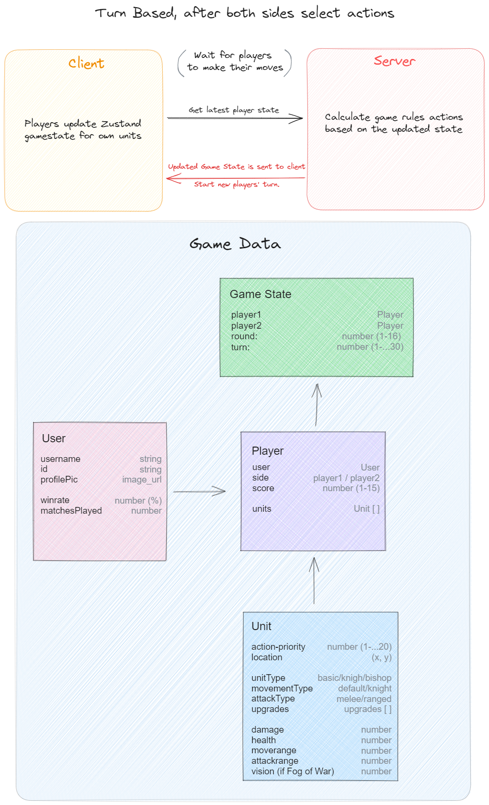
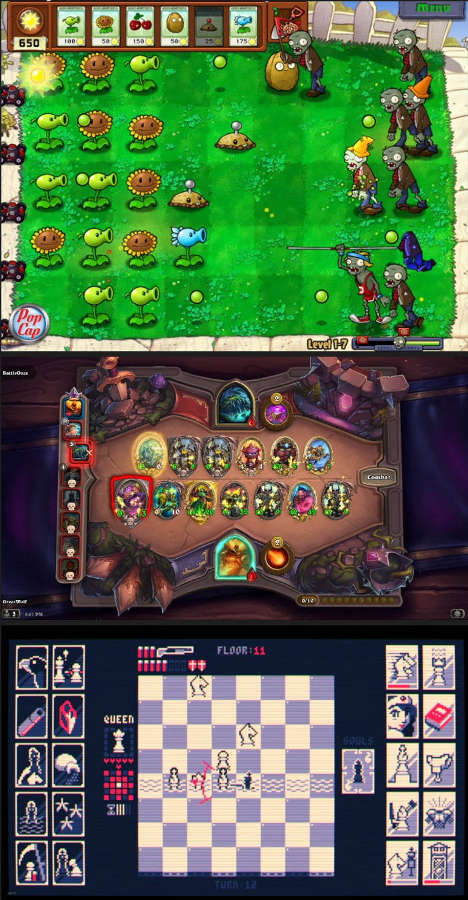

# Game Design

The initial design for this project is a game that contains features such as: player vs player gameplay, turn-based action, a square grid map with movable and blocked areas.

## Match starts
Match against another player in a randomly generated or a designed map.

The map has spawn areas for each players' side, to start the match the first strategic choice of the players has to be decided.

Each player places their units where they wish on their spawn area.

## Turn-based combat
The action will be played as turn-based, with the twist that both players can choose their actions at the same time before the game state is synced and the actions are calculated and played out on the server.

### Action-priority
There could be many ways to decide which unit will go first when it's time to process the actions. One way is to set up an "action-priority" property to units. So that if a knight wants to move their position to on top of an unit to insta-kill the enemy, they would have to know if the enemy is going to change position before they move.

Action-priority could be set so that every other action is by the opposing player. The player who's unit makes the first move can be swapped each round of the match.

## The Game Arena Action
Drag-and-drop for unit actions. 

*To avoid endlessly running rounds, we can start breaking edges of the map.*

## Player Units & Item Upgrades
Start first round as simple pawns with melee attacks.

As a new round begins, the players get a choice in an upgrade item. They can choose a unit which they give the upgrade to.

### Unit Upgrades
Tier 1 choices could be small ones like 1+ movement, +1 damage or +1 health to a unit of choice.

After tier 1 choices unit upgrades will start to appear, these could include:
- Horse/Rider (knight)
- Ranger/Sniper (bishop)
- Ice skater (Rook)

# Development
Below is a speculative drawing about the structure of the game data as well as how the client and server communication will work to make the multiplayer gameplay work.

# Style of the Game (moodboard)

