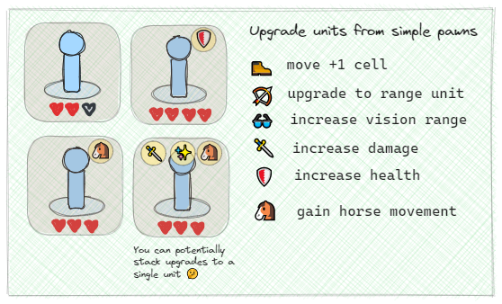

# Game Design

The initial design for this project is a game that contains features such as: player vs player gameplay, turn-based action, a square grid map with movable areas as well as blocked areas.

## Match starts

## Turn-based combat
Start first round as simple pawns with melee attacks.

## The Game Arena Action
Drag-and-drop for unit actions. 

To avoid endlessly running rounds, we can start breaking edges of the map.

## Player Units & Upgrades
As a new round begins, the players get a choice in an upgrade item. They can choose a unit which they give the upgrade to.

